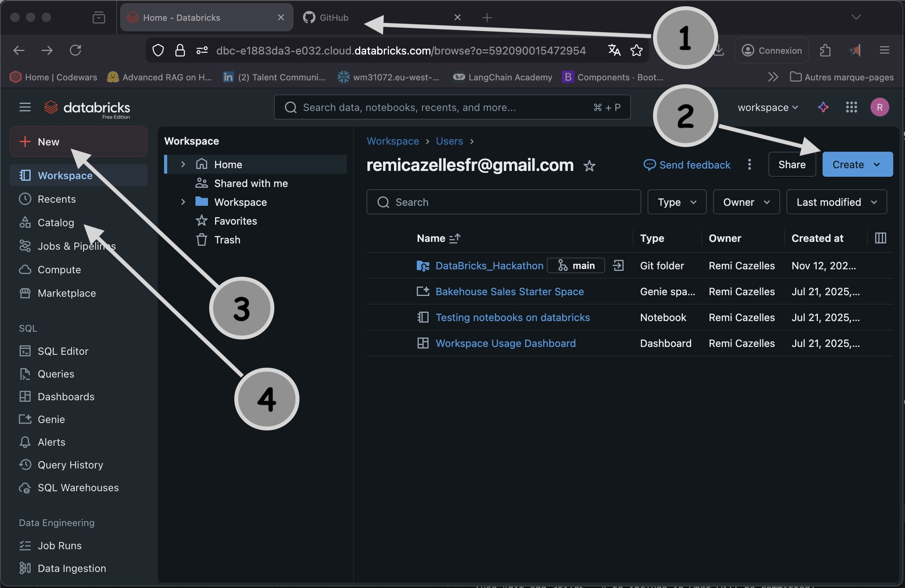
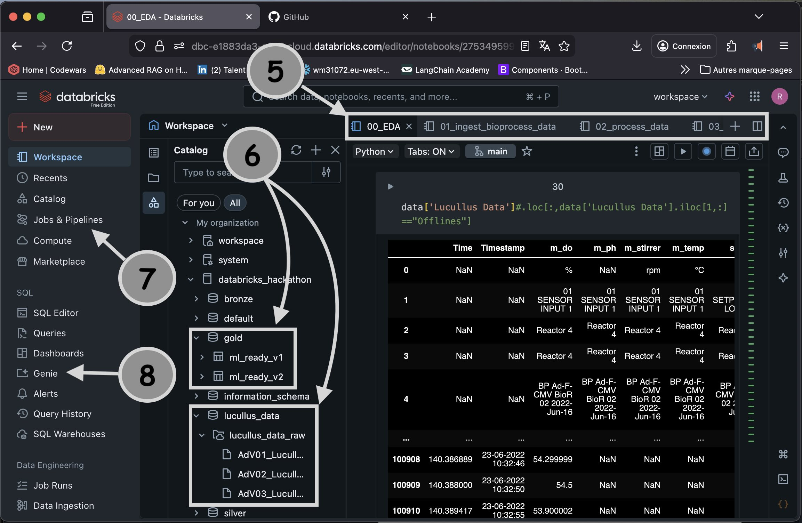
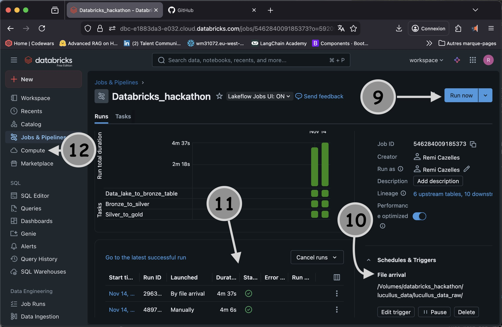
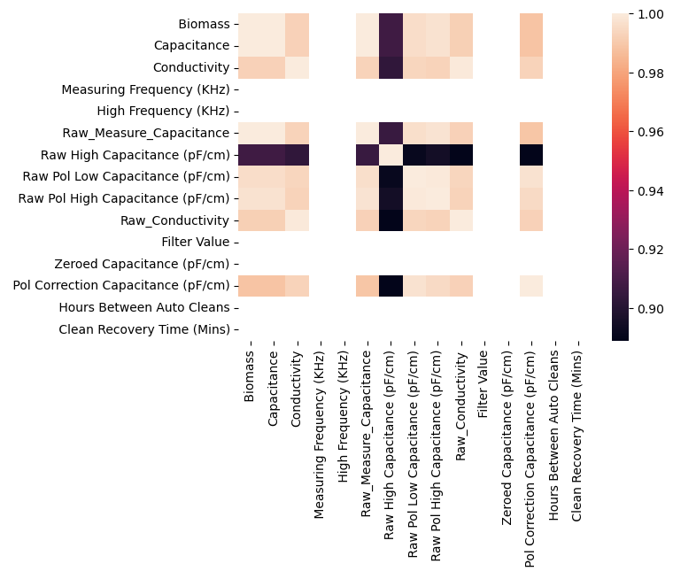
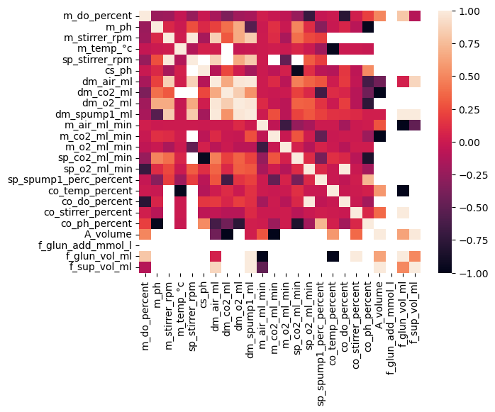

# DataBricks_Hackathon : Bioprocess Digital Twin Accelerator (Data Engineering)
This project focuses on developing a robust, scalable, and automated data engineering pipeline for bioprocess monitoring and digital twin development using the Databricks Lakehouse Platform.
* Necessary to install Databricks on the github repo

## Project Goal

To implement a Medallion Architecture (Bronze, Silver, Gold layers) on Databricks using Delta Lake, transforming multi-sensor bioprocess time series data into a unified, query-optimized knowledge base. This foundation aims to accelerate the development of mechanistic models and digital twins for optimal operation and control of complex biologics production (Adenovirus in HEK293 cells).

## Stack and setup
```
Platform	      Databricks Lakehouse Platform (Unity Catalog, Delta Lake, Photon Compute)
Data Repository	  GitHub for version control and CI/CD integration.
Data Source	      Bioprocessing time series datasets from Kamen Lab Bioprocessing Repository (McGill University).
Collaboration	  Databricks Git Integration (Git Folders) for collaborative development and automated deployments.
```

## Dataset overview
We are using this datset from Kamen Lab Bioprocessing Repository (McGill University).
Multivariate data analysis on multi-sensor measurement for in-line process monitoring of adenovirus production in HEK293 cells
https://borealisdata.ca/dataset.xhtml?persistentId=doi:10.5683%2FSP3%2FKJXYVL
Project Desciption: Digital-twin of bioreactor for accelerated design and optimal operations in production of complex biologics - Mechanistic models to describe biological processes more realistically. Four multi-sensor bioprocess time series datasets to support the manuscript titled: "Multivariate data analysis on multi-sensor measurement for in-line process monitoring of adenovirus production in HEK293 cells." Under review at Biotechnology and Bioengineering. (2024-01-23)


  ### List of files / explanation

  Three bioreactors were operated in batch or fed-batch modes (refer to Table 1
  in publication for more details):

    1) Adenovirus 1 (AdV01)
    2) Adenovirus 2 (AdV02)
    3) Adenovirus 3 (AdV03)
  
    * An Excel spreadsheet of bioprocess data, each containing three sheets,
      named like '*_LucullusBioprocessData.xlsx'. Sheet contents:

        - Sheet 1, 'Lucullus Data':
            Bioprocess data exported from Lucullus, including dielectric data
        - Sheet 2, 'Capacitance':
            Dielectric data acquired via Futura SCADA
        - Sheet 3, 'Explain' (excluding batch CG):
            Lucullus variable (port) specifications

    * An '*_MWF/spectra/' directory. This contains the emission spectra data
      produced by the multi-wavelength fluorometer. WE DON'T USE THIS


    ==> Capacitance - sampling rate = 1 minute
    ==> Lucullus Data - sampling rate = 5 minutes


## Using Guidance
https://customer-academy.databricks.com/learn/courses/2469/get-started-with-databricks-for-data-engineering


### Stepwise of project

1. Github, create project (https://github.com/ -> (+) Create New -> New Repository)
2. Databricks, create new 'Git Folder' (paste Git repository URL)
3. Create a Unity catalog (Catalog -> Create a catalog -> configure access -> assign tag)
4. Within the Unity Catalog, create a Volumne, grant access to worksapce and upload data in the Lake



5. Set up script/notebook for EDA and ETL pipeline 
6. Create Bronze Silver Gold tables from DeltaLake (Medallion architecture)
7. Set up an automation pipeline
8. Use Genie a ChatBot to answer question on data from SQL generated code



9. Run Pipeline
10. Set automatic triggers and alerts
11. Track progress and performance
12. Purchase COmpute to train ML model




## EDA

1. 'Capacitance' 

most of the variables are higly correlated (c.a. perason > 0.9). All the variables are processing results of raw data. There are no NaN values or duplicated rows. 
We keep 2 variables: Capacitance and Conductivity. Dataset shape from (8436, 22) to (8436, 2).

2. 'Lucullus Data'

We remove 14 variables labelled "Offline", 28 variables with a unique value, 8 variables with null values > 95%, and 7 varibales which are higly correlated (pearson r2 > 0.7). 
A total of 49 variables were removed. Dataset shape from (100913, 68) to (100908, 19)




We test linear regression on Biomass Capacitance. The result of the fit gives r2 = 1 with p_val < 1e-5 F stat > 1e13 with a coefficent of 9845. Conductivity and any of the two above has correlation at 0.64, it can be used with other variables to predict Capacitance.

